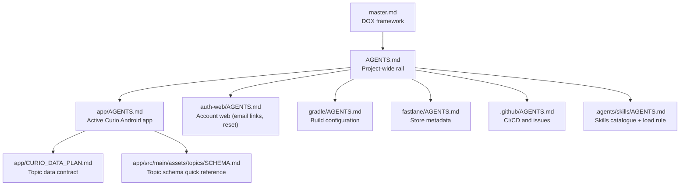

# DOX Hierarchy — Curio

## Mermaid diagram



## Current tree

```text
master.md                       DOX framework
AGENTS.md                       Project-wide rules and workflow
DOX_TREE.md                     This hierarchy
Prompt.md                       Running request and validation log
README.md                       Curio project overview

app/
  AGENTS.md                     Active Android module contract
  CURIO_DATA_PLAN.md            Topic taxonomy and authoring contract
  src/main/                     Curio source, resources, and topic assets

auth-web/
  AGENTS.md                     Account web contract
  index.html, */index.html      Supabase email landings, account desk, legal
  assets/                       theme.css + curio.js (no build step)
  api/                          Vercel functions: public config, delete account

.agents/skills/
  AGENTS.md                     Skills catalogue + the load-the-match rule
  curio-design/                 OUR motion + consistency contract
  <community skill>/            Third-party (unvetted) reference skills
skills-lock.json                Skill sources + content hashes

gradle/                         Version catalog and wrapper configuration
.github/                        Android CI, release workflow, issue templates
fastlane/                       Android store metadata and release notes
scripts/                        Topic authoring, validation, and maintenance tools
```

## Reading order

When editing a file, read the DOX chain from top to bottom:

1. `master.md` — framework contract
2. `AGENTS.md` — project-wide environment and workflow rules
3. The nearest child `AGENTS.md` for the target path
4. Any local source-of-truth document named by that child contract
